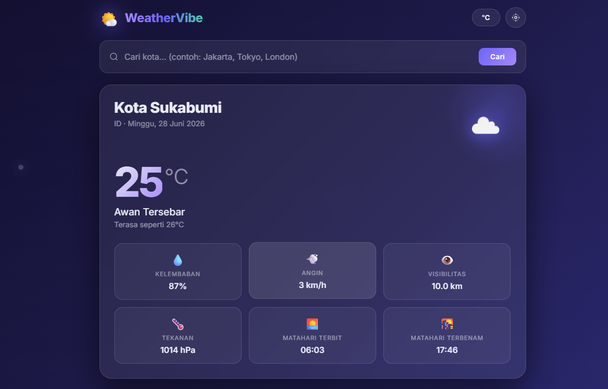
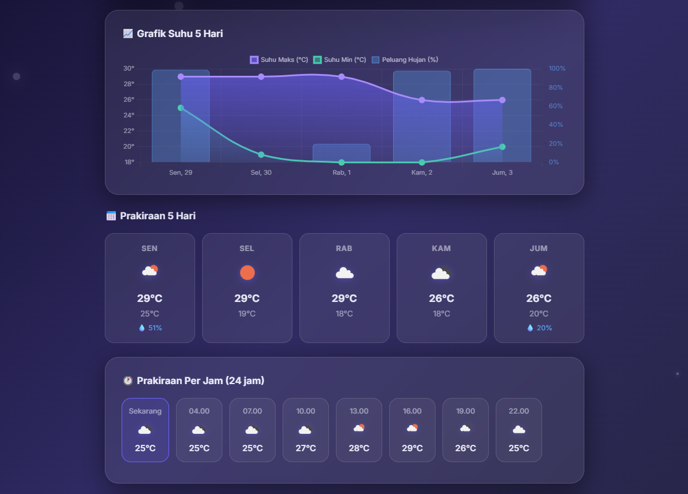
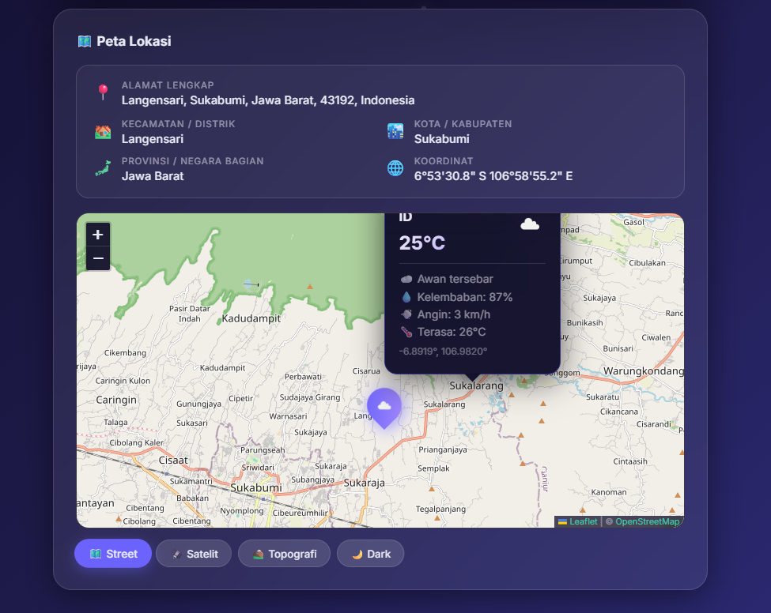

<div align="center">


<br/>


<br/>

[](https://weathervibe-se.netlify.app/)
[](https://developer.mozilla.org/en-US/docs/Web/JavaScript)
[](https://developer.mozilla.org/en-US/docs/Web/HTML)
[](https://developer.mozilla.org/en-US/docs/Web/CSS)
[](https://netlify.com)
[](LICENSE)

[](https://openweathermap.org/api)
[](https://leafletjs.com)
[](https://chartjs.org)
[]()
[]()
[]()

<br/>

> A modern, beautiful weather application with real-time data, interactive maps, temperature charts, GPS detection, and dynamic weather animations — all secured with Netlify Functions.

</div>

---

## 📑 Table of Contents

- [📸 Preview](#-preview)
- [✨ Features](#-features)
- [🔄 Workflow](#-workflow)
- [🛠 Tech Stack](#-tech-stack)
- [📁 Project Structure](#-project-structure)
- [⚙️ Installation](#-installation)
- [🔑 API Configuration](#-api-configuration)
- [☁️ Deploy to Netlify](#-deploy-to-netlify)
- [🔒 Security](#-security)
- [📈 Performance](#-performance)
- [🌍 Browser Support](#-browser-support)
- [🗺 Roadmap](#-roadmap)
- [🤝 Contributing](#-contributing)
- [📄 License](#-license)

---

## 📸 Preview

<div align="center">

### 🌡️ Current Weather


<br/><br/>

### 📈 Charts & Forecast


<br/><br/>

### 🗺️ Interactive Map


</div>

---

## ✨ Features

<div align="center">

| Feature | Description | Status |
|:---:|:---|:---:|
| 🌤️ **Real-time Weather** | Temperature, humidity, wind, visibility, pressure, sunrise & sunset | ✅ |
| 📅 **5-Day Forecast** | Complete daily forecast with min/max temperature & rain probability | ✅ |
| 🕒 **Hourly Forecast** | 24-hour weather prediction with horizontal scroll | ✅ |
| 📈 **Temperature Chart** | Beautiful interactive chart powered by Chart.js | ✅ |
| 🌧️ **Rain Probability** | Precipitation chance visualized in chart | ✅ |
| 🗺️ **Interactive Map** | Leaflet.js with 4 map layers | ✅ |
| 🛰️ **Satellite Layer** | Switch to satellite view | ✅ |
| 🏔️ **Terrain Layer** | Topographic map layer | ✅ |
| 🌙 **Dark Map Layer** | Dark themed map | ✅ |
| 📍 **GPS Detection** | Auto-detect location via browser Geolocation API | ✅ |
| 🔍 **Smart Autocomplete** | City name suggestions while typing | ✅ |
| 🌡️ **°C / °F Toggle** | Switch temperature unit instantly, saved to localStorage | ✅ |
| 🎨 **Weather Animation** | Dynamic particles — rain, snow, clouds, sunshine | ✅ |
| 📱 **Responsive Design** | Fully responsive on mobile, tablet & desktop | ✅ |
| 🔒 **Secure API Key** | API key hidden via Netlify Functions — never exposed in frontend | ✅ |

</div>

---

## 🔄 Workflow

```text
        📍 Detect User Location
                 │
                 ▼
      🌐 Request Weather API
                 │
                 ▼
      📊 Process Weather Data
                 │
        ┌────────┼────────┐
        ▼        ▼        ▼
    📈 Charts  🗺️ Maps  🌤️ Current
        │        │        │
        └────────┼────────┘
                 ▼
      ✨ Weather Animations
                 │
                 ▼
       📱 Responsive Interface
```

---

## 🛠 Tech Stack

<div align="center">


<br/>

| Library | Version | Usage |
|---|---|---|
| [OpenWeatherMap API](https://openweathermap.org/api) | v2.5 | Real-time weather data & geocoding |
| [Leaflet.js](https://leafletjs.com) | 1.9.4 | Interactive map |
| [Chart.js](https://chartjs.org) | 4.4.0 | Temperature & rain chart |
| [Netlify Functions](https://docs.netlify.com/functions/overview/) | — | Serverless API key proxy |

</div>

---

## 📁 Project Structure

```text
WeatherVibe/
│
├── 📄 index.html                   # Main page
├── 🎨 style.css                    # Styling & animations
├── ⚡ app.js                       # App logic, API calls, map, chart
├── ⚙️  netlify.toml                 # Netlify configuration
│
├── 📂 netlify/
│   └── 📂 functions/
│       └── 🔑 apikey.js            # Serverless function — API key proxy
│
├── 📂 screenshots/
│   ├── ss1.png
│   ├── ss2.png
│   └── ss3.png
│
└── 📖 README.md
```

---

## ⚙️ Installation

### 💻 Local Development

```bash
# 1. Clone repository
git clone https://github.com/Sir-S27/weather-app.git
cd weather-app

# 2. Run with Live Server (VS Code extension)
# or Python:
python -m http.server 5500

# 3. Open browser
# http://127.0.0.1:5500
```

Enter your OpenWeatherMap API key in the form that appears on first launch.

---

## 🔑 API Configuration

### Get a Free API Key

1. Register at [openweathermap.org/api](https://openweathermap.org/api)
2. Verify your email
3. Copy the API Key from your dashboard

> ⚡ New API keys take ~10 minutes to activate after registration.

### Set Environment Variable (Netlify)

```
Site Settings → Environment Variables → Add variable

Key   : OWM_API_KEY
Value : your_api_key_here
```

The API key is read from the environment variable via Netlify Function —
**never exposed in the frontend code.**

---

## ☁️ Deploy to Netlify

```bash
# 1. Push to GitHub
git add .
git commit -m "Deploy WeatherVibe"
git push origin main

# 2. Connect repo at app.netlify.com
# 3. Add environment variable: OWM_API_KEY
# 4. Deploy automatically!
```

---

## 🔒 Security

```bash
# Make sure .gitignore exists
echo ".env" >> .gitignore
echo ".env.local" >> .gitignore
```

| Protection | Status |
|---|---|
| API Key in Environment Variables | ✅ |
| Netlify Functions as Proxy | ✅ |
| No Hardcoded Secrets | ✅ |
| HTTPS Deployment | ✅ |
| No API Exposure in Frontend | ✅ |

> ⚠️ **Never** hardcode your API key in `app.js` or any frontend file.

---

## 📈 Performance

<div align="center">

| Category | Rating |
|---|---|
| ⚡ Performance | ⭐⭐⭐⭐⭐ |
| 🎨 UI Design | ⭐⭐⭐⭐⭐ |
| 🔒 Security | ⭐⭐⭐⭐⭐ |
| 📱 Responsiveness | ⭐⭐⭐⭐⭐ |
| 📈 Chart Quality | ⭐⭐⭐⭐⭐ |
| 🗺️ Map Performance | ⭐⭐⭐⭐⭐ |

</div>

---

## 🌍 Browser Support

<div align="center">

| Browser | Supported |
|---|---|
| Chrome | ✅ |
| Edge | ✅ |
| Firefox | ✅ |
| Safari | ✅ |
| Opera | ✅ |

</div>

---

## 🗺 Roadmap

- [x] Real-time Weather
- [x] Hourly Forecast
- [x] 5-Day Forecast
- [x] GPS Detection
- [x] Interactive Maps
- [x] Temperature Chart
- [x] Weather Animation
- [x] Secure API Key
- [ ] Air Quality Index (AQI)
- [ ] UV Index
- [ ] Severe Weather Alerts
- [ ] PWA Support
- [ ] Offline Mode
- [ ] Favorite Cities
- [ ] Multi Language Support
- [ ] Weather Radar

---

## 🤝 Contributing

Contributions are always welcome!

```bash
# 1. Fork the repository
# 2. Create a new branch
git checkout -b feature/amazing-feature

# 3. Commit your changes
git commit -m "Add amazing feature"

# 4. Push to branch
git push origin feature/amazing-feature

# 5. Open a Pull Request
```

**Found a bug?** Open an [Issue](https://github.com/Sir-S27/weather-app/issues) with:
- Screenshot
- Browser name & version
- Steps to reproduce
- Error message

---

## 🙏 Credits

Built with love using:

- [OpenWeatherMap API](https://openweathermap.org) — Weather data
- [Leaflet.js](https://leafletjs.com) — Interactive maps
- [Chart.js](https://chartjs.org) — Beautiful charts
- [Netlify](https://netlify.com) — Hosting & serverless functions

---

## 📄 License

Distributed under the [MIT License](LICENSE). Free to use, modify, and improve.

---

<div align="center">

### 🌤️ WeatherVibe
*Beautiful Weather Experience for Everyone*

<br/>

[](https://weathervibe-se.netlify.app/)

<br/>


<br/>


</div>